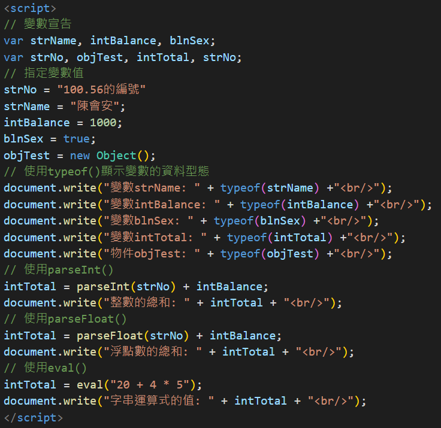
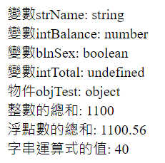

# HTML

## SGML 慣用語法

### 標籤 Tags

ex.&lt;p&gt; &lt;p/&gt;

### 屬性 Attributes

width、height、src 就是 Attributes

```HTML
// HTML

```

## 內容:HTML5 基本結構

&lt;script&gt; **程式碼**放在這裡面

```HTML
// HTML
<!DOCTYPE html>
<html>
<head>
<meta charset="utf-8"/>
<title>Ch1_4_2.html</title>
</head>
<body onload = "javascript:alert('大家好')">
    <script>
       document.write("第一支JAVA程式!" + "<br>");
    </script>
</body>
</html>
```

# Java Script

## 引用外部 JS 檔案

```HTML
// HTML
<script src="Ch1_5_3.js"></script>
```

## 註解

一行註解//

多行註解

```HTML
// HTML
/*

*/
```

## 變數/資料型態/運算子/資料型態轉換

### 變數

#### 命名

- 變數名稱區分大小寫
- 不能使用保留字 ex.for、var
- 變數名稱開頭只能使用 英文 跟 \_  
  <font color=red>**數字** 跟 **.** 不可當變數名稱</font>

#### 宣告

- 多個變數用 , 分隔
- 可以宣告完後，直接賦值

#### 變數是否存在

存在跑 A，不存在跑 B

```Java Script
// Java Script
<script>
// 變數宣告
var strName = "陳會安";
// 檢查變數是否存在
if (window.strName)
   document.write("strName存在:" + window.strName + "<br/>");
else
   document.write("strName不存在:" + window.strName + "<br/>");
// 一個不存在的變數
if (window.intBalance)
   document.write("intBalance存在:" + window.intBalance + "<br/>");
else
   document.write("intBalance不存在:" + window.intBalance + "<br/>");
</script>
```

### 資料型態

#### 數值

- 整數值  
  包含 0、正整數、負整數  
  可用十進位、八進位(0 開頭，每個位數值是 0\~7)、十六進位(0x 開頭，每個位數值是 0\~9、A\~F)

- 浮點數值

#### 字串

- 用\' 或 \"

#### 布林值

True 或 False

#### Null

表示 空 或 不存在 的特殊值，故意設為沒有值  
<font color=red>明確設置為\"沒有值\"的情況</font>

```Java Script
// Java Script
var myVar = null;
```

#### Undefined

- 有存在，尚未定義變數值
- 變數不存在

```Java Script
// Java Script
var myVar;
var myVar = undefined;
```

#### escape 逸出字元

在字元資料型態中顯示無法使用鍵盤輸入的特殊字元

| escape |         說明          |
| :----: | :-------------------: |
|  \\b   |       Backspace       |
|  \\f   |     FF、Formfeed      |
|  \\n   | LF、Linefeed 換行符號 |
|  \\r   |     CR、Enter 鍵      |
|  \\t   |        Tab 鍵         |
|  \\\'  |        \' 符號        |
|  \\\"  |       \\\" 符號       |
|  \\\\  |       \\\\ 符號       |

### 運算子

#### 說明

先乘除後加減

#### 運算子順序

|    運算子    |              說明              |    性質    |
| :----------: | :----------------------------: | :--------: |
|     ( )      |              括號              |            |
|      -       |              負號              |            |
|    ++、--    |           遞增、遞減           |            |
|   \*、/、%   |        乘法、除法、餘數        | 算術運算子 |
|     +、-     |           加法、減法           | 算術運算子 |
|      !       |              Not               | 邏輯運算子 |
|      &&      |              AND               | 邏輯運算子 |
|     \|\|     |               OR               | 邏輯運算子 |
| >、>=、<、<= | 大於、大於等於、小於、小於等於 | 比較運算子 |
|    ==、!=    |          等於、不等於          | 比較運算子 |
| <<、>>、>>>  |     左移、右移、無符號右移     | 位元運算子 |
|      &       |              AND               | 位元運算子 |
|      ^       |              XOR               | 位元運算子 |
|      \|      |               OR               | 位元運算子 |
|      ?:      |                                | 條件運算子 |
|    =、op=    |                                | 指定運算子 |

#### 算術運算子\-種類

| 運算子 |      說明      |
| :----: | :------------: |
|   -    |      負號      |
|   ++   |    遞增運算    |
|   --   |    遞減運算    |
|   \*   |      乘法      |
|   /    |      除法      |
|   %    |      餘數      |
|   +    | 加法、字串相接 |
|   -    |      減法      |

#### 比較運算子

| 運算子 |   說明   |  範例  | 運算結果 |
| :----: | :------: | :----: | :------: |
|   ==   |   等於   | 6 = 3  |  false   |
|   !=   |  不等於  | 6 <> 3 |   true   |
|   <    |   小於   | 6 < 3  |  false   |
|   >    |   大於   | 6 > 3  |   true   |
|   <=   | 小於等於 | 6 <= 3 |  false   |
|   >=   | 大於等於 | 6 >= 3 |   true   |

#### 邏輯運算子

| 運算子 |                              說明                               |
| :----: | :-------------------------------------------------------------: |
|   !    |                        NOT，回傳相反的值                        |
|   &&   |             AND，兩個運算元都為 true，運算式為 true             |
|  \|\|  | OR，兩個運算元<font color=red>任一</font>為 true，運算式為 true |

#### 位元運算子

| 運算子 |   A   |   B   |   C   |     D     |  範例  |   結果   |    說明    |
| :----: | :---: | :---: | :---: | :-------: | :----: | :------: | :--------: |
|   ~    | 1(01) |       |       |           |   ~A   |  -2(10)  |  NOT 運算  |
|   <<   |       |       | 3(11) |           |  C<<2  | 12(1100) |  左移運算  |
|   >>   |       | 2(10) |       |           |  B>>1  |   1(1)   |  右移運算  |
|  >>>   |       |       |       | 16(10000) | D>>>1  | 8(0100)  | 無符號右移 |
|   &    | 1(01) |       | 3(11) |           | A & C  |  1(01)   |    AND     |
|   ^    | 1(01) | 2(10) |       |           | A ^ B  |  3(11)   |    XOR     |
|   \|   | 1(01) | 2(10) |       |           | A \| B |  3(11)   |     OR     |

#### 指定運算子

| 運算子 |   範例   | 相當的運算式 |        說明        |
| :----: | :------: | :----------: | :----------------: |
|   =    |  x = y   |     N\/A     |      指定敘述      |
|   +=   |  x += y  |  x = x + y   | 數值相加、字串相接 |
|   -=   |  x -= y  |  x = x - y   |        減法        |
|  \*=   | x \*= y  |  x = x \* y  |        乘法        |
|  \/=   | x \/= y  |  x = x \/ y  |        除法        |
|   %=   |  x %= y  |  x = x % y   |        餘數        |
|  <<=   | x <<= y  |  x = x << y  |  位元左移 y 位元   |
|  >>=   | x >>= y  |  x = x >> y  |  位元右移 y 位元   |
|  >>>=  | x >>>= y |  x = x>>> y  | 無符號右移 y 位元  |
|   &=   |  x &= y  |  x = x & y   |        AND         |
|   ^=   |  x ^= y  |  x = x ^ y   |        XOR         |
|  \|=   | x \|= y  |  x = x \| y  |         OR         |

### 資料型態轉換

Java Script 運算元需要**相同**型態

<font color=red>字串 > 數值 > 布林</font>

|   運算式    |    強制轉換處理    |
| :---------: | :----------------: |
| 數值 + 字串 | 數值強制轉換成字串 |
| 布林 + 字串 | 布林強制轉換成字串 |
| 布林 + 數值 | 布林強制轉換成數值 |

#### 轉換函數

##### parselnt 整數

轉換成整數，如果字串沒有數值，就傳回 NaN，轉換時可以指定十六、十和八進位

```Java Script
// Java Script
parselnt( )
```

##### parseFloat 浮點數

轉換成浮點數，如果字串沒有數值，就傳回 NaN

```Java Script
// Java Script
parseFloat( )
```

##### eval 運算式的計算

將運算式的字串參數當作運算式，函數可以傳回運算式的計算結果

```Java Script
// Java Script
eval( )
```

##### typeof 顯示變數的資料型態

取得變數的資料型態也就是 string、number、boolean、undefined 和 object 等資料型態

```Java Script
// Java Script
typeof( )
```




